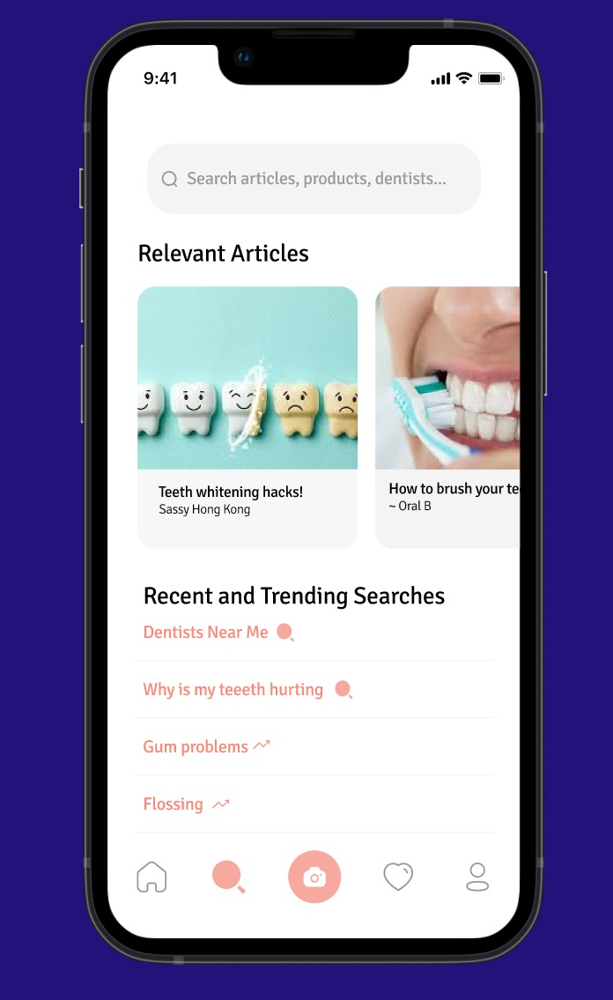
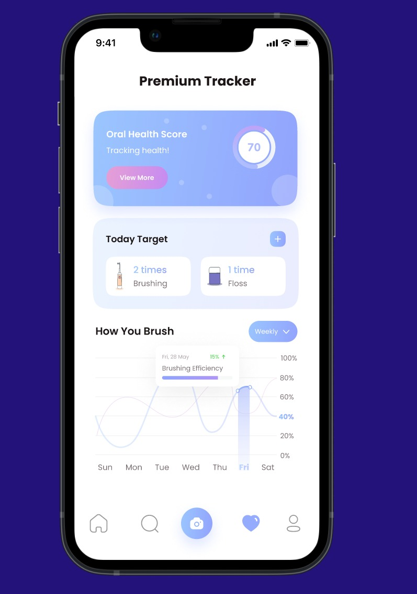

# CityHack22 Project Submission
## Project: Dentell

## Team: Top Models
## Members
- Charan Kumar Raju RUDRARAJU (Leader)
- Sai Navyanth VOBBILISETTY
- Ankolika DE
- Rishabh NAUTIYAL
- Niharika PANT

## Description of the Project (300 words)
When was the last time your tooth was throbbing and yet you decided to skip the visit to the dentist? Dental consultation is expensive, due to which people wait till the last minute to actually go to the dentist for problems that could have been prevented early on. Market research has shown that upto 81.2% of children and 96.7% of adults have problems with their teeth and ignore going to dentists till it is unbearable and 80.4% would like to have affordable early detection and prevention options. Thus, we created Den.tell, an application through which users can take a picture of their teeth and receive an analysis of their condition from the comfort of their smartphone. It leverages algorithms from Machine Learning and Artificial Intelligence to detect dental issues and has resources to educate an user about dental hygiene. It further has the option to connect to dentists in nearby areas for further procedures. It also introduces a premium feature to track dental health through the treatment and recovery period, which gives a detailed analysis of users progress and gives challenges to improve. Further, we plan to focus on children and train specific ML models to cater to their needs. 

## 3 Most Impactful Features of the Project (with Screenshot and Short Description (150 words))
### 1. Accessible and Inexpensive detection of dental issues anywhere and anytime.

### 2. Free educational Resources to Increase Oral hygiene awareness.

### 3. Long term personalised tracking of dental health through treatment and recovery

## Tech used (as many as required)
1. Tensorflow - ML
2. flask - ML/Backend
3. Heroku - Hosting
4. InceptionResNetV2 - ML 
5. YOLOV3 - Computer Vision
6. Flutter - App Development
7. Figma - App Developement / Design

## Link
- https://youtu.be/5N0vuLrVoSc
